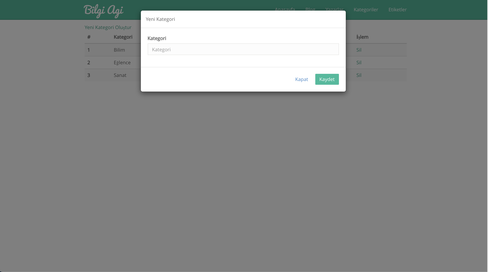
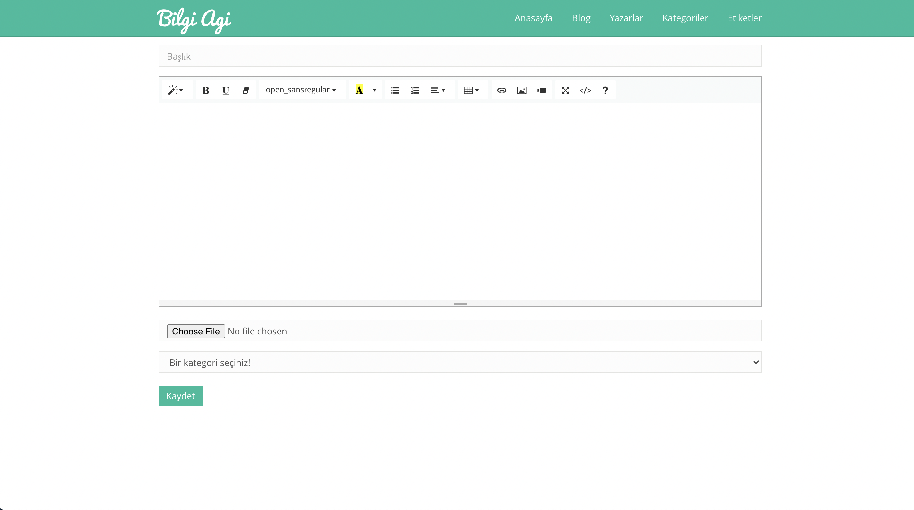

# Bilgi Ağı Blog Sitesi 

- Bilgi Ağı Asp Net Core , Entityframework Core ve MSSQL veritabanı kullanılarak geliştirilmiştir.

- Kullanıcılar sisteme kayıt olup, giriş yapabilir.

- Kullanıcılar anasayfada yazarların paylaşmış olduğu blogları görüntülüyebilir, arayabilir ve inceleyebilir.

- Kullancılar bloglara yorum yapabilir.

- Yönetici sisteme yazar ekleyip yazarları yönetebilir.

- Yönetici aynı panelden kategori yönetimi yapabilir.

- Yazarlar blog yönetimi yapabilir ve bloglarının okunma sayılarına bakabilir.

